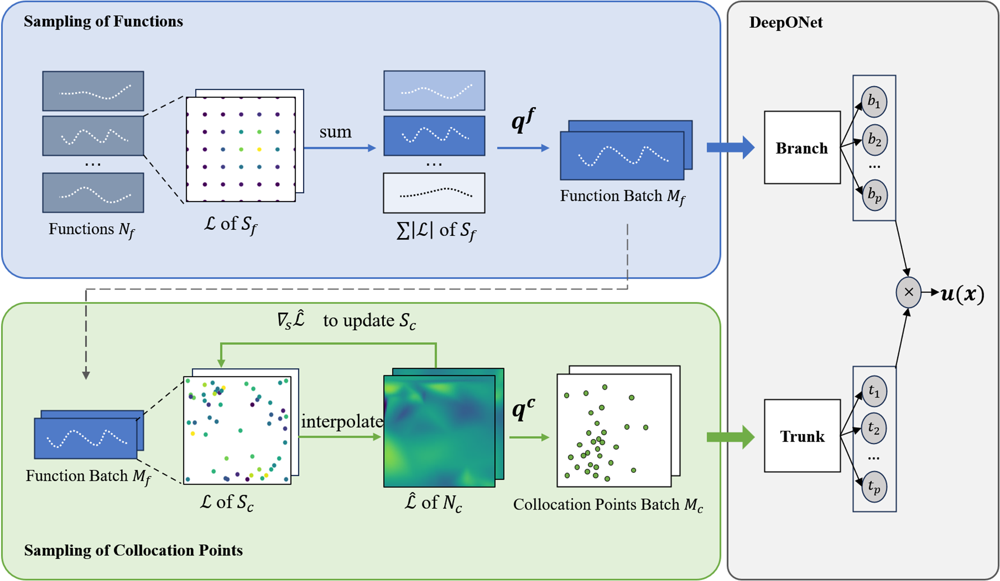

#  Importance Sampling for DeepONet

This is the implementation of [DONIS: Importance Sampling for Training Physics-Informed DeepONet](https://www.ijcai.org/proceedings/2025/0603.pdf).  

## Introduction
In this work, we introduce a two-step importance sampling framework that sequentially 
applies importance sampling to the function and collocation point inputs of DeepONet, 
which prioritizes mini-batch samples with greater influence (measured by the loss magnitude) 
on the learning objective, enabling faster convergence and better accuracy.

## Citation

## License
This repository is licensed under the MIT License.  
Note: This project uses [DeepXDE](https://github.com/lululxvi/deepxde), which is licensed under the GNU Lesser General Public License v2.1.
